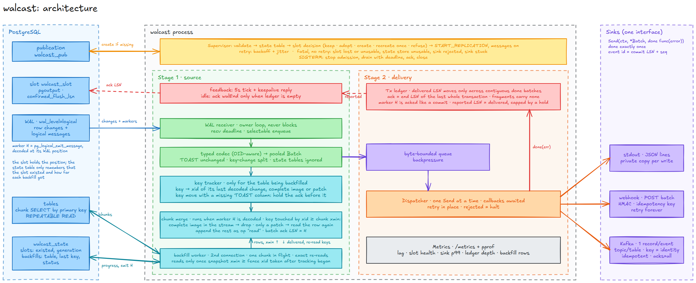

# walcast

Postgres change data capture pipeline. Streams row changes from the write-ahead log over logical replication (`pgoutput`) and emits them as JSON.



## Dev

Needs Go, Docker, and [golangci-lint](https://golangci-lint.run) v2.

```sh
cp .env.example .env
make up     # Postgres with wal_level=logical
make run    # events on stdout, logs on stderr, Ctrl+C for graceful shutdown
```

Other targets: `make build`, `make test`, `make test-integration` (uses `DATABASE_URL` from `.env` when set, otherwise starts its own Postgres container and needs only Docker), `make bench`, `make fuzz`, `make vuln`, `make lint`, `make fmt`, `make down`. If port 5432 is taken, set `POSTGRES_PORT` in `.env` and match it in `DATABASE_URL`.

The publication and the replication slot are created on first start if missing. An existing publication is never altered; a mismatch with `PUBLICATION_TABLES` is logged. If the slot disappears or is invalidated while walcast runs, it exits instead of recreating it, because a fresh slot would silently skip every change made in between.

walcast also remembers the slot in the source database, in `STATE_SCHEMA.slots`, so the same protection holds across restarts. When the table knows a slot that no longer exists (dropped by hand, lost in a failover or a restore), walcast refuses to start and prints the exact `SLOT_RECREATE_GENERATION` value that accepts the gap. A value authorises at most one start: it is used up when the slot is recreated, and also when it was set while the slot still existed, so a forgotten variable cannot let a later loss through. A slot that already exists without a row is adopted. Changes to walcast's own two tables are never emitted as events; any other table in the same schema streams normally.

On the first start the role needs `CREATE` on the database to make the schema and table. To run without it, create them ahead of time and grant the role `USAGE` on the schema and `SELECT, INSERT, UPDATE` on the tables; walcast runs no DDL once a table exists (the second one is only needed for a backfill):

```sql
CREATE SCHEMA walcast_state;
CREATE TABLE walcast_state.slots (
    slot_name    text PRIMARY KEY,
    generation   integer NOT NULL DEFAULT 0,
    created_at   timestamptz NOT NULL DEFAULT now(),
    recreated_at timestamptz
);
CREATE TABLE walcast_state.backfills (
    slot_name       text NOT NULL,
    table_name      text NOT NULL,
    table_oid       oid NOT NULL,
    slot_generation integer NOT NULL,
    status          text NOT NULL,
    upper_key       text,
    last_key        text,
    pending_keys    text,
    rows_emitted    bigint NOT NULL DEFAULT 0,
    started_at      timestamptz NOT NULL DEFAULT now(),
    finished_at     timestamptz,
    PRIMARY KEY (slot_name, table_name)
);
```

Backfill progress belongs to a slot, so two pipelines can copy one table to different destinations. A `backfills` table made before progress was kept per slot is rekeyed on the next start, which needs ownership of the table. Its rows are kept when the state schema knows exactly one slot; with several their origin is unknown, so they are dropped and those tables are copied again.

Anyone who can write to this table can switch the protection off, so grant it to the walcast role only.

## Events

One JSON object per line:

```json
{"table":"public.users","op":"update","lsn":"0/16B3700","commit_lsn":"0/16B3748","seq":0,"txid":742,"ts":"2026-09-20T10:00:00Z","old":{"id":7},"new":{"id":7,"name":"x"},"unchanged":["bio"]}
```

- `op` is `insert`, `update`, `delete`, `truncate`, or `read` for a row copied by a backfill.
- An update that changes the row's replica identity (its primary key) is emitted as a `delete` of the old key followed by an `insert` of the new one, both carrying `"origin":"update"`. Every key's history then stays self-consistent for consumers partitioned by key.
- `commit_lsn` + `seq` identify an event; use them to deduplicate.
- A `read` event carries the whole row in `new` and is an upsert. It has `backfill` + `seq` instead of `commit_lsn` and `txid`; `backfill` is the table's OID and the chunk's marker LSN, so it is unique per delivered chunk, also across restarts: a chunk is positioned at a marker in the WAL, and a marker's LSN can equal the `commit_lsn` of the next transaction, so the two must not share an id space. A repeated `read` is harmless to apply again. Its `ts` is when the chunk was read, not a commit time.
- The `insert` half of a key change can list `unchanged` columns. Take them from the row the preceding `delete` removed. During a backfill walcast sends such a row again as a `read`, so a consumer that started empty still gets every column. With Kafka the two halves are keyed differently and can land on different partitions, so a consumer that only sees one partition cannot take the columns from the `delete`: it needs a store shared across partitions, or a table whose primary key is never updated.
- `old` holds the replica identity columns only, or the full row with `REPLICA IDENTITY FULL`.
- `unchanged` lists TOASTed columns Postgres did not resend. They are absent from `new`, not null.
- Both connections pin `TimeZone=UTC`, `DateStyle`, `IntervalStyle`, `extra_float_digits` and `bytea_output`, so a value renders the same in a streamed event and in a `read`. `timestamptz` values are therefore in UTC.
- Values: booleans, integers and floats are native JSON (`NaN` and `±Infinity` become strings), `jsonb` is embedded as is and `json` with its raw line breaks removed, `numeric` is a string to keep precision, everything else keeps its Postgres text form. Invalid UTF-8 becomes U+FFFD.

## Backfill

`BACKFILL_TABLES` copies the rows that existed before streaming started, as `read` events, while the stream keeps running. Tables are copied one at a time, and walcast's own state tables are never copied, not even with `all`. It is off by default, and each table is copied once; progress lives in `STATE_SCHEMA.backfills`, so a restart continues where it stopped and a crash repeats at most one chunk.

Rows are read in primary-key chunks under a `REPEATABLE READ` snapshot. After each chunk walcast writes a marker into the WAL with `pg_logical_emit_message` and merges the chunk into the stream where that marker is decoded. A chunk row is dropped when the stream already delivered a newer complete image of the same key, and read again when the stream only delivered a patch that lacks an unchanged TOAST column. "Newer" is decided by transaction id, not by position: on Postgres a change can be decoded before any query can see it (a writer waiting for a synchronous standby is the long version of that window), so every change by a transaction at or above the chunk snapshot's `xmin` counts as newer. A consumer that applies events in order ends up with exactly the table.

A table is refused, with an error that says why, unless all of this holds:

- it is an ordinary table with a primary key and the default replica identity, not partitioned and without child tables
- the publication includes it without a row filter or column list, and publishes insert, update, delete and truncate
- row-level security does not hide rows from the walcast role
- the source is a writable primary running Postgres 14 or newer

The role needs `SELECT` on backfilled tables. A write transaction that was already open when the session started delays the first chunk until it ends, and walcast logs that it is waiting. While a key-changing update on a backfilled table is waiting for its row to be read again, the confirmed LSN stays before that transaction, so a crash replays it instead of forgetting it. A key change on a table that is waiting for its turn is saved on that table's progress row and read first when its turn comes, so the confirmed LSN is not held back for the length of another table's copy. Delete a table's row from `STATE_SCHEMA.backfills` to copy it again; accepting a slot gap with `SLOT_RECREATE_GENERATION` does that for every configured table, which is also how the gap gets repaired. With the Kafka sink and `KAFKA_EMIT_TRUNCATE` off, a `TRUNCATE` during or after a backfill is not visible to consumers.

## Sinks

`SINK=stdout` (default) writes the events to stdout, logs go to stderr.

`SINK=webhook` POSTs each batch to `WEBHOOK_URL` as `application/x-ndjson`, one event per line, one request in flight at a time so a retry is never overtaken by a later batch.

| Header | Meaning |
| --- | --- |
| `X-Walcast-Signature` | `t=<unix>,v1=<hex>`, where `v1` is HMAC-SHA256 of `<unix>.<body>` keyed with `WEBHOOK_SECRET`. Verify it and reject timestamps outside your tolerance to stop replays. |
| `X-Walcast-Idempotency-Key` | Stable across retries of the same batch. |
| `X-Walcast-Events` | Number of events in the body. |
| `X-Walcast-Attempt` | 1 for the first try. |

A 2xx response means the batch is safely stored on your side: only then is its LSN confirmed to Postgres. 5xx, 408, 429 and network errors are retried forever with capped backoff (`Retry-After` is honoured in full, up to one hour, even above `WEBHOOK_RETRY_MAX`); Postgres keeps the WAL meanwhile, so set `max_slot_wal_keep_size`. Any other status, including a redirect, is a permanent rejection and stops the process rather than skipping the batch. The error names the status and your `X-Request-Id` response header if you send one; the response body is never logged, since it may echo row data. Batch boundaries can differ after a restart, so deduplicate on `commit_lsn` + `seq`, not on the idempotency key alone.

`SINK=kafka` produces one record per event to the topic `KAFKA_TOPIC_PREFIX` + `schema.table`, for example `walcast.public.users`. Topics must exist unless the broker auto-creates them; a missing topic is retried with backoff until it appears.

- Value: the event JSON. Key: the row's replica identity as compact JSON, for example `{"id":7}`. All changes of a row share a partition, so consumers see them in commit order.
- Rows without a stable identity (no primary key, `REPLICA IDENTITY FULL` or `NOTHING`, truncates) are keyed by table name, which keeps them ordered in one partition.
- Truncates are not sent unless `KAFKA_EMIT_TRUNCATE=true`. A truncate is keyed by table while rows are keyed by identity, so a consumer could read it after a later insert from another partition and wipe that new row. A skipped truncate is logged.
- The producer is idempotent with `acks=all`: broker-side retries neither duplicate nor reorder records within a partition. A replay after a restart can still duplicate, so deduplicate on `commit_lsn` + `seq`.
- An LSN is confirmed to Postgres only after every record of its batch was acknowledged by the brokers. Errors Kafka marks non-retriable (record too large, authorization, invalid topic) stop the process.
- TLS is required unless every broker is a loopback host, and always with SASL (`plain`, `scram-sha-256`, `scram-sha-512`). Without TLS, traffic also goes in plaintext to whatever brokers the bootstrap ones advertise. A private CA is picked up from the system pool, which `SSL_CERT_FILE` or `SSL_CERT_DIR` can point at.
- Table names that cannot map to a topic unambiguously (quoted identifiers with dots, spaces or non-ASCII, over 249 bytes with the prefix) are sanitised and get a short hash of the exact schema and table, so two tables never share a topic; the chosen topic is logged.
- A record above `KAFKA_MAX_MESSAGE_BYTES` stops the process. The error names the topic, the size and the event's `commit_lsn` and `seq`, never the row key or data. Raise it together with the topic's `max.message.bytes`.

## Metrics

Set `METRICS_ADDR` (for example `127.0.0.1:9090`) to serve Prometheus metrics on `/metrics`. Nothing listens unless it is set. `PPROF_ENABLED=true` adds `/debug/pprof/` to the same listener; it exposes process internals and can be used to load the process, so keep it on loopback, and walcast warns when it is not.

With metrics on, walcast opens one more ordinary connection and reads `pg_replication_slots` every 15 seconds for the slot metrics. It needs no extra privilege, and a failed check is logged and retried without touching the stream.

| Metric | Meaning |
| --- | --- |
| `walcast_events_delivered_total{op}` | events the sink confirmed, by `insert`, `update`, `delete`, `truncate`, `read` |
| `walcast_events_skipped_total` | events a sink chose not to send, such as truncates to Kafka without `KAFKA_EMIT_TRUNCATE`; not counted as delivered |
| `walcast_batches_delivered_total`, `walcast_bytes_delivered_total` | delivered batches and their JSON bytes |
| `walcast_delivery_failures_total`, `walcast_sink_retries_total` | failed deliveries that ended a session, and webhook retries |
| `walcast_sink_delivery_seconds` | time a batch spent in the sink |
| `walcast_end_to_end_seconds` | from the oldest commit in a batch to its delivery, so no event in the batch waited longer |
| `walcast_received_lsn`, `walcast_delivered_lsn`, `walcast_reported_lsn` | stream positions; reported is the last position Postgres was actually sent, received minus reported is the backlog in WAL bytes, and reported stays behind delivered until the next feedback or while an ack is held back |
| `walcast_inflight_batches`, `walcast_inflight_bytes` | batches the ledger still holds and the bytes the sink has not confirmed; a confirmed batch stays in the count until every batch before it is confirmed too |
| `walcast_slot_wal_status{status}` | 1 for the slot's current `wal_status` (`reserved`, `extended`, `unreserved`, `lost`), 0 for the others; alert on `unreserved` |
| `walcast_slot_retained_wal_bytes`, `walcast_slot_lag_bytes`, `walcast_slot_safe_wal_bytes` | WAL the slot keeps on the server, WAL written since the position Postgres has confirmed, and what may still be written before the slot is lost; `NaN` when not known, as with no `max_slot_wal_keep_size` |
| `walcast_streaming`, `walcast_reconnects_total` | 1 while a session is up, and how often one had to be restarted |
| `walcast_backfill_rows_total`, `walcast_backfill_chunks_total` | backfill progress |
| `walcast_backfill_rows_superseded_total`, `walcast_backfill_rows_reread_total` | chunk rows dropped because the stream had a newer complete image, and rows read again |

Each latency is exposed twice: as a summary with `quantile` labels that read directly, and as `<name>_hist` with Prometheus `le` buckets, which can be aggregated across instances. Go runtime and process metrics are included. Throughput numbers, a CPU profile and what measuring found are in [PERFORMANCE.md](PERFORMANCE.md).

## Delivery

At-least-once. A transaction's end LSN is confirmed to Postgres only after every batch holding its events, and every batch before it, has been delivered by the sink. A restart or reconnect resumes from the slot's confirmed LSN, so unconfirmed events are replayed, never lost. The stdout sink is best-effort: a successful write is treated as delivered. The webhook sink treats a 2xx response as delivered, the Kafka sink a broker acknowledgement of every record.

Failures a reconnect cannot fix (an unencodable change, an unusable slot, deliveries that never settle, a batch the webhook receiver or Kafka rejects for good) stop the process instead of retrying forever.

Large transactions are split across batches; only the batch holding the commit carries an LSN to confirm. A slow sink applies backpressure to Postgres while status updates keep flowing, so `wal_sender_timeout` does not drop the connection. Transactions are decoded with protocol version 1, so Postgres buffers a transaction until it commits.

## Config

Read from the environment. A `.env` file is loaded if present and never overrides real variables.

| Variable | Default | Notes |
| --- | --- | --- |
| `DATABASE_URL` | required | Postgres connection string, user needs `REPLICATION`. walcast does not force TLS here as it does for the webhook and Kafka: the default `sslmode=prefer` can be downgraded, so use `sslmode=verify-full` for any server that is not on loopback. Removed from the process environment once read, like `WEBHOOK_SECRET` and `KAFKA_SASL_PASSWORD` |
| `SLOT_NAME` | `walcast_slot` | lowercase letters, digits, underscore |
| `PUBLICATION_NAME` | `walcast_pub` | same charset |
| `PUBLICATION_TABLES` | all tables | comma separated `schema.table`; all tables needs superuser |
| `STATE_SCHEMA` | `walcast_state` | schema in the source database for walcast's own state; not `public` or a system schema, and not the database role's name, because `search_path` starts with `"$user"` and the role's unqualified tables would land in it |
| `SLOT_RECREATE_GENERATION` | `0` | set to the value from the "slot is gone" error to recreate a lost slot and accept the gap; each value works for one start only |
| `BACKFILL_TABLES` | off | comma separated `schema.table` list, or `all` for every table of the publication; see Backfill |
| `BACKFILL_CHUNK_ROWS` | `10000` | rows per chunk; shrinks by itself when a chunk hits the byte budget |
| `BACKFILL_CHUNK_BYTES` | `4194304` | memory budget for one chunk's rows |
| `METRICS_ADDR` | off | `host:port` for `/metrics`, for example `127.0.0.1:9090` |
| `PPROF_ENABLED` | `false` | serve `/debug/pprof/` on the metrics listener; needs `METRICS_ADDR` |
| `LOG_LEVEL` | `info` | `trace`, `debug`, `info`, `warn`, `error` |
| `LOG_FORMAT` | `json` | `json` or `console` |
| `SHUTDOWN_TIMEOUT` | `10s` | drain deadline on SIGINT/SIGTERM |
| `SINK_SETTLE_TIMEOUT` | `5m` | after a failed session, how long to wait for its in-flight deliveries before exiting so a restart can drop the stuck client |
| `FEEDBACK_INTERVAL` | `5s` | standby status updates, keep well under `wal_sender_timeout` |
| `SERVER_TIMEOUT` | `60s` | reconnect when Postgres sends nothing for this long |
| `BATCH_MAX_BYTES` | `65536` | batch size before it is sealed |
| `BATCH_LINGER` | `5ms` | max wait for more events at a commit boundary |
| `INFLIGHT_MAX_BYTES` | `67108864` | memory bound for undelivered batches |
| `RECONNECT_MIN_DELAY` | `500ms` | backoff floor, doubles with jitter |
| `RECONNECT_MAX_DELAY` | `30s` | backoff cap |
| `SINK` | `stdout` | `stdout`, `webhook` or `kafka` |
| `WEBHOOK_URL` | required for webhook | `https`, or `http` to a loopback host; no credentials in the URL |
| `WEBHOOK_SECRET` | required for webhook | at least 16 characters, signs every request |
| `WEBHOOK_TIMEOUT` | `10s` | per request |
| `WEBHOOK_RETRY_MIN` | `500ms` | retry backoff floor, doubles with jitter |
| `WEBHOOK_RETRY_MAX` | `30s` | retry backoff cap |
| `KAFKA_BROKERS` | required for kafka | comma separated `host:port` |
| `KAFKA_TOPIC_PREFIX` | `walcast.` | topic is prefix + `schema.table` |
| `KAFKA_CLIENT_ID` | `walcast` | |
| `KAFKA_TLS` | `false` | must be `true` unless every broker is a loopback host |
| `KAFKA_SASL_MECHANISM` | none | `plain`, `scram-sha-256` or `scram-sha-512` |
| `KAFKA_SASL_USERNAME` / `KAFKA_SASL_PASSWORD` | | required with a mechanism |
| `KAFKA_EMIT_TRUNCATE` | `false` | send truncate events, see the ordering caveat above |
| `KAFKA_MAX_MESSAGE_BYTES` | `1000012` | largest record batch, match the topic's `max.message.bytes` |

## Layout

```
cmd/walcast            entrypoint, signal handling
internal/app           supervisor: reconnect with backoff
internal/replication   connection, publication + slot setup, state tables, receive loop, feedback, backfill
internal/event         pgoutput to JSON encoder, pooled batches
internal/ledger        in-order ack tracking
internal/sink          Sink interface, writer, webhook and Kafka sinks
internal/backoff       jittered exponential backoff
internal/metrics       metrics set, /metrics and pprof listener
internal/config        env config
internal/logger        zerolog setup
```
